# Implementation Plan - Workflow Enhancements: Two-Level Approvals, Secure Work Orders, and WhatsApp Ticket Sharing

This document describes the design and implementation details for upgrading the travel desk workflow with L1/L2 personnel verification, digital signature work order email attachments, and WhatsApp ticket dispatching with PDF drive links.

## User Review Required

> [!IMPORTANT]
> The workflow mandates that:
> 1. **L1 Approval** is restricted to **Arnab** or **Sazid** (`arnab@hemrajgroup.com` or `sazid@hemrajgroup.com`).
> 2. **L2 Approval** is restricted to **Rohit Aggarwal** (`rohit.ji@hemrajgroup.com`).
> 3. **Secure Work Order Emails** are sent directly to the vendor with a digitally signed hash representing system validation.
> 4. **WhatsApp Dispatch** includes a customizable PDF drive link of the ticket.

We will seed these specific users into `src/db/database.json` and `server.ts` to allow easy testing via the "Active Sandbox Operator" switcher.

## Open Questions

- Should we strictly prevent other users from approving L1/L2 in the UI, or simply show warning labels? 
  * *Proposed solution*: We will enforce validation in the UI and backend, warning the user if their selected simulated sandbox profile does not match the required approver names.
- For the "encrypted digital signature", we will generate a SHA-256 HMAC or mock digital signature hash (`WO-DSIGN-SHA256-...`) based on the job card ID, winning quote amount, and approver details, and present it clearly as a "Work Order Seal" attached to the email.

---

## Flowchart: Travel Indent to Job Card Closure

```mermaid
flowchart TD
    %% Define Styles
    classDef startEnd fill:#f8fafc,stroke:#0f172a,stroke-width:2px;
    classDef process fill:#eff6ff,stroke:#2563eb,stroke-width:1.5px;
    classDef approval fill:#fffbeb,stroke:#d97706,stroke-width:2px;
    classDef document fill:#f0fdf4,stroke:#16a34a,stroke-width:1.5px;
    
    Start([1. Raise Travel Indent]) --> CheckCompliance{Compliance Audit};
    class Start startEnd;
    
    %% Compliance
    CheckCompliance -- Valid Passport & Vaccines --> CreateJobCard[2. Initialize Job Card<br/>Stage: QUOTATION];
    CheckCompliance -- Invalid / Expiring Documents --> Block[Flag Compliance Dashboard / Block];
    class CreateJobCard process;
    
    %% Quotation
    CreateJobCard --> Sourcing[3. RFQ & Quotation Bidding<br/>Collect Vendor Proposals];
    Sourcing --> CalculateCheapest[Automate L1/L2/L3 Cost Rank];
    CalculateCheapest --> SelectWinner[Select Winning Quote];
    class Sourcing,CalculateCheapest,SelectWinner process;
    
    %% Two-Level Approvals
    SelectWinner --> ApprovalStage[4. Stage: APPROVAL];
    ApprovalStage --> L1Check{L1 Approver Name?};
    class L1Check approval;
    
    L1Check -- Arnab or Sazid --> ApproveL1[Approve Level 1];
    L1Check -- Other User --> RejectL1[Warning: Requires Arnab/Sazid];
    ApproveL1 --> L2Check{L2 Approver Name?};
    class L2Check approval;
    
    L2Check -- Rohit Aggarwal --> ApproveL2[Approve Level 2 VP Signoff];
    L2Check -- Other User --> RejectL2[Warning: Requires Rohit Aggarwal];
    class ApproveL1,ApproveL2 approval;
    
    %% Work Order Dispatch
    ApproveL2 --> WorkOrderGen[5. Generate Work Order<br/>Append Secure Digital Signature];
    WorkOrderGen --> SystemEmail[Email Vendor Work Order PDF];
    class WorkOrderGen,SystemEmail document;
    
    %% Booking
    SystemEmail --> StageBooking[6. Stage: BOOKING];
    StageBooking --> BookTicket[Book Ticket & Invoice Upload];
    BookTicket --> GeminiScan[Gemini AI Scan & PNR Verification];
    GeminiScan --> WhatsAppShare[7. Option: Send to Passenger via WhatsApp<br/>Include PNR & Drive Link of Ticket PDF];
    class StageBooking,BookTicket,GeminiScan,WhatsAppShare process;
    
    %% Finance
    WhatsAppShare --> StageFinance[8. Stage: FINANCE];
    StageFinance --> AuditCosts[Compare Winning Quote vs Actual Booking];
    AuditCosts --> GSTVerify{GST details correct?};
    GSTVerify -- Yes --> PhysicalInvoice{Physical Invoice Received?};
    class StageFinance,AuditCosts,GSTVerify,PhysicalInvoice process;
    
    %% Payments & Close
    PhysicalInvoice -- Yes --> StageRecon[9. Stage: RECONCILIATION];
    StageRecon --> ProcessPayment[Log Payment: Mode, Ref & Amount];
    ProcessPayment --> CloseCard([10. Job Card CLOSED]);
    class StageRecon,ProcessPayment process;
    class CloseCard startEnd;
    
    %% Rejections/Rollback Paths
    ApproveL1 -- Rejected L1 --> RollbackQuote[Rollback Stage to QUOTATION];
    ApproveL2 -- Rejected L2 --> RollbackQuote;
    RollbackQuote --> Sourcing;
```

---

## Proposed Changes

### Database Layer

#### [MODIFY] [database.json](file:///c:/Users/Vaibhav/Downloads/hemraj-group-personal-travel-desk/src/db/database.json)
- Seed Arnab (`arnab@hemrajgroup.com`) and Sazid (`sazid@hemrajgroup.com`) as `TRAVEL_APPROVER`s.
- Rename Rohit ji to `Rohit Aggarwal (COO / VP Commercial)` with email `rohit.ji@hemrajgroup.com` and role `VP_COMMERCIAL`.
- Add fields to `JobCard` model in simulated data if needed (e.g. `workOrderDispatched`, `workOrderDigitalSignature`, `pdfDriveLink`).

---

### Backend Layer

#### [MODIFY] [server.ts](file:///c:/Users/Vaibhav/Downloads/hemraj-group-personal-travel-desk/server.ts)
- Update default RBAC users list seed data in `DEFAULT_DB_DATA` to matches the updated `database.json`.
- Support saving new fields like `pdfDriveLink`, `workOrderDispatched`, `workOrderDigitalSignature` via `/api/job-cards/:id` update endpoint.

---

### Frontend Layer

#### [MODIFY] [types.ts](file:///c:/Users/Vaibhav/Downloads/hemraj-group-personal-travel-desk/src/types.ts)
- Update `JobCard` interface to include optional fields:
  - `workOrderDispatched?: boolean`
  - `workOrderDigitalSignature?: string`
  - `pdfDriveLink?: string`

#### [MODIFY] [JobCardManager.tsx](file:///c:/Users/Vaibhav/Downloads/hemraj-group-personal-travel-desk/src/components/JobCardManager.tsx)
1. **Quotation L1/L2 Approval Interface**:
   - Check if current active user matches Arnab or Sazid for L1. Show an active warning if the user switches to a role or name other than them.
   - Check if current active user matches Rohit Aggarwal for L2. Show warning if not.
   - Record the specific L1 approver name (Arnab / Sazid) and L2 approver name (Rohit Aggarwal) in the audit log and approvals state.
2. **Work Order Generation**:
   - Display a "Dispatch Work Order to Vendor" component in the `APPROVAL` / `BOOKING` stage.
   - When clicked, simulate sending the email to the vendor. Show a simulated email send dialog showing the "Work Order" document content, complete with an "Encrypted Digital Signature" badge containing a secure cryptographic hash (e.g., `WO-SIG-SHA256-${id}-${date}`).
   - Update the job card audit logs and state to mark work order as dispatched.
3. **WhatsApp Dispatch with PDF Drive Link**:
   - In the `BOOKING` stage (under confirmation details), add a text input for the traveler's ticket "PDF Drive Link" (defaulting to a simulated viewable link if not specified).
   - Update the WhatsApp dispatch anchor's text content to include the PNR and the `pdfDriveLink` (e.g., "Drive Link of Ticket: [URL]").

---

## Verification Plan

### Automated Tests
- Type checking: `npm run lint`
- Frontend build: `npm run build`

### Manual Verification
1. Create a new Indent, approve it, and generate a Job Card.
2. Go to the Job Card Sourcing tab, enter quotes, and choose a winning quote.
3. Switch user profile to **Arnab** or **Sazid** in Settings -> verify L1 approval is enabled and prints their name. Verify it blocks other names from clicking approval.
4. Switch user profile to **Rohit Aggarwal** -> verify L2 approval is enabled and prints his name.
5. In the next stage, verify that the "Send Work Order" button generates the digitally signed work order. Verify the email popup details and check the job card audit log for the digital signature hash.
6. In the booking stage, enter a ticket PDF Drive Link, and click "Send via WhatsApp" -> verify the simulated WhatsApp URL contains the correct passenger name, PNR, and PDF drive link.
